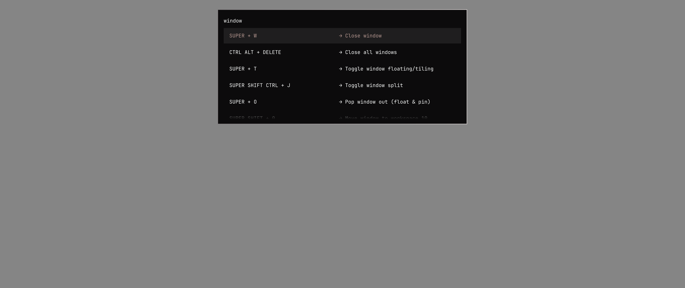
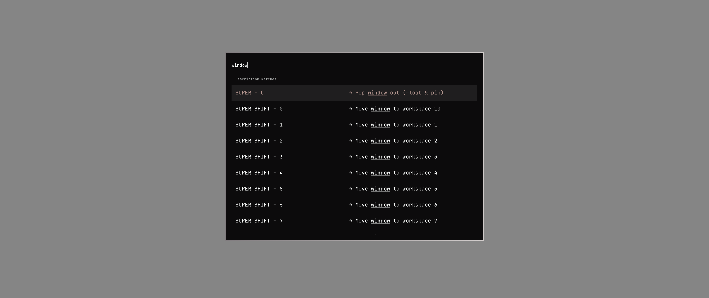

# Native draft versus the batching patch

The opt-in native shortcut prototype uses 46–57% less process CPU work per filtering edit than the batched stock selector in this run. This is the additional improvement beyond the small batching PR, measured separately from the stock/batched run in [README.md](README.md).

| Shortcut list | Options | Measured edits per variant | Batched stock | Native prototype | CPU reduction |
| --- | ---: | ---: | ---: | ---: | ---: |
| Hyprland | 236 | 492 | 2.797 ms | 1.506 ms | 46.2% |
| Tmux | 43 | 288 | 3.269 ms | 1.398 ms | 57.2% |
| Herdr | 49 | 396 | 2.745 ms | 1.387 ms | 49.5% |

This uses the same machine, CPU affinity, real Wayland windows, typing sequences, warm-up, three measured rounds, and two opposite-order passes described in the batching report. Exact observations, fixtures, and native source hashes are in [native.json](results/native.json); distributions and per-pass results are in [native-summary.json](results/native-summary.json). The model and view were built from the native draft's `contrib/shortcut-picker` sources against the same current-upstream shared QML components as stock.

The two implementations intentionally differ in search behavior and view layout. Native adds modifier-order-independent chord matching, ranking, fuzzy description matching, section headings, and bold underlines. The same `space super` or `splt wndw` input can return native results when stock has none. Each implementation is checked against its own independent oracle for exact labels, details, and selection values, and the native visible delegate highlights are checked. These measurements compare the same user workload, not equivalent filtering algorithms.

At an empty query, both show the same source records in source order. The native view uses a shared selection surface and reused delegates without an offscreen cache. Its unfiltered card is 933×683 logical pixels versus stock's 933×617 for the same 800/500 request; positioning and row spacing also differ. The gallery shows `window` on the same source fixture:

| Batched stock | Native prototype |
| --- | --- |
|  |  |

## Validation

The native draft includes 4,545 deterministic comparisons against an independent JavaScript reference in Qt's engine, plus Qt model-invariant checks on every transition. The same 4,545 comparisons also pass with AddressSanitizer and UndefinedBehaviorSanitizer (including leak checking outside the restricted sandbox). Private socket tests cover missing/unloadable binaries, timeout, protocol changes, disconnection, malformed replies, unknown flags, exact literal/Unicode selections, and cancellation. The actual QML view passed warm-up matching/highlight checks and returned the exact final selection in every benchmark process. Screen captures and short local recordings were visually reviewed; recording runs are excluded from the tables.

## Reproduce

Build the native draft according to its `contrib/shortcut-picker/README.md`, and run from this evidence checkout:

```bash
python3 benchmarks/selector-batching/run.py \
  --fixtures benchmarks/selector-batching/results/filtering.json \
  --native-root /path/to/native-checkout/contrib/shortcut-picker \
  --variant stock-batched --variant custom \
  --output /tmp/native-comparison.json
python3 benchmarks/selector-batching/summarize.py /tmp/native-comparison.json
```

No command-startup or physical keypress latency claim is made here. The socket client is included in the draft and tested for correctness; this benchmark isolates filtering after the picker opens. Measurements are on a workstation and should be repeated on the older hardware this design targets before promising a particular perceived speedup.
