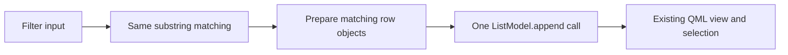
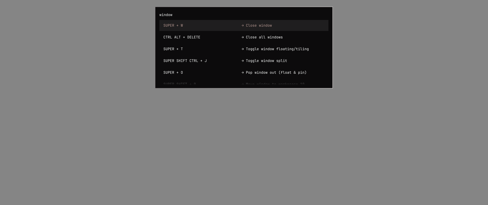

# Selector batching on current Omarchy

Appending filtered rows once instead of individually cuts Hyprland selector filtering CPU work by about half in this run. The production change is three added lines and one replacement in `shell/plugins/menu/Menu.qml`; it preserves stock search, ordering, roles, layout, and selection behavior. The regular non-selector menu still appends rows individually; this patch only batches selector rows.

The stock source is Omarchy `quattro` at `c5b4db77d68e7fbce5cf11120712ea322557e967`. The small batching patch is committed separately as `d7f3bff7`. This evidence branch keeps the harness, fixtures, and results out of the production PR's diff.



## Results

Mean whole-block process CPU time per filter edit, including deferred work between inputs. Two fresh-process passes in opposite order, each with one warm-up and three measured typing sequences. Both variants use identical saved source records.

| Shortcut list | Options | Measured edits per variant | Stock | Batched | CPU reduction |
| --- | ---: | ---: | ---: | ---: | ---: |
| Hyprland | 236 | 492 | 5.735 ms | 2.891 ms | 49.6% |
| Tmux | 43 | 288 | 3.481 ms | 3.309 ms | 5.0% |
| Herdr | 49 | 396 | 3.010 ms | 2.715 ms | 9.8% |

The two Hyprland passes measured 5.706/5.763 ms for stock and 2.915/2.866 ms for batched. The shorter lists benefit less; the Tmux difference is small relative to between-pass variation. No startup-speed claim is made for this patch.

Raw observations and exact fixtures: [filtering.json](results/filtering.json). Aggregated frame times, userspace GUI-thread instructions, and per-pass CPU values: [summary.json](results/summary.json). On Hyprland, GUI instructions per edit fell from 69.09 million to 18.10 million. This instruction count ends at the relevant Qt frame callback and does not include every deferred process instruction; process CPU is the broader measurement.

Machine: Ryzen 7 9800X3D, RTX 5090, NVIDIA 610.57.04, Linux 7.2.5-3-omarchy, Quickshell 0.3.1-1, Qt 6.11.2. Test processes are pinned to CPU 0, with real 5120×2160 physical Wayland windows at scale 2 and Qt's OpenGL basic render loop. Package versions and source/fixture SHA-256 hashes are recorded in every result file. The Omarchy package remains installed at 4.0.4-1, but the tested QML, shared components, and record-generation commands come from the checkout above.

These are workstation measurements, not old-laptop measurements. The timer runs from posting a Qt key event through a frame whose synchronization follows the input handler. It excludes physical input, compositor presentation, and display scanout. Scheduling affects frame tails; a CPU reduction is not an equal reduction in perceived latency.

## Correctness and appearance

- The checkout's focused menu, shortcut-menu, plugin, and guard tests passed: 166 checks.
- [Actual Qt ListModel comparison](results/parity.json): 960 cases / 12,388 compared rows, with all roles, selection values, selection clamping, input-only mode, and layout serials identical. Includes empty results, replacement lists, duplicate labels, icon/detail records, Unicode, and literal markup.
- Every warm-up edit in the live harness checks exact labels, details, and returned values against the stock substring oracle. The final selection is checked without dispatching an action. Blank-window and hardware-counter multiplexing checks must pass.
- Reference/candidate captures for `window` use the same current-upstream view. Across 11,059,200 pixels, 417 differ by at most 1 channel levels: [comparison](results/images.json). The screenshots and main timing run use the same saved 236-row Hyprland fixture. Short local screen recordings were also reviewed for filtering, empty-result recovery, and layout stability; recording runs are excluded from the performance tables.

| Stock | Batched |
| --- | --- |
|  |  |

## Reproduction

Use this evidence branch, which retains the unmodified stock `Menu.qml` and applies `batch.patch` only to a temporary copy. Requires Omarchy/Quickshell, a Wayland session, a C++ compiler, Qt Quick development files, Python 3, and permission to read userspace performance counters. The private harness uses temporary Quickshell hosts; it does not deploy a shell plugin, alter keybindings, or execute shortcut actions.

```bash
python3 benchmarks/selector-batching/run.py \
  --fixtures benchmarks/selector-batching/results/filtering.json \
  --output /tmp/selector-filtering.json
python3 benchmarks/selector-batching/verify.py --results /tmp/selector-filtering.json
python3 benchmarks/selector-batching/summarize.py /tmp/selector-filtering.json
```

Omit `--fixtures` to collect current records once using the checkout's `--print` commands; the driver saves them before starting any cases and reuses them for both variants. Run this while not typing into other applications: the temporary overlays take keyboard focus. The benchmark includes a warm-up and records incomplete output after each successful case so an interruption is visible rather than silently discarded.

The optional `--native-root` plus `--variant custom` measures the separate native draft. Its search intentionally differs from stock; it is a comparison of the same user workload, not identical search algorithms. Native checks use the independent `Oracle.js` for ranking and visible underlines. The stock-only production patch has no dependency on that prototype.
